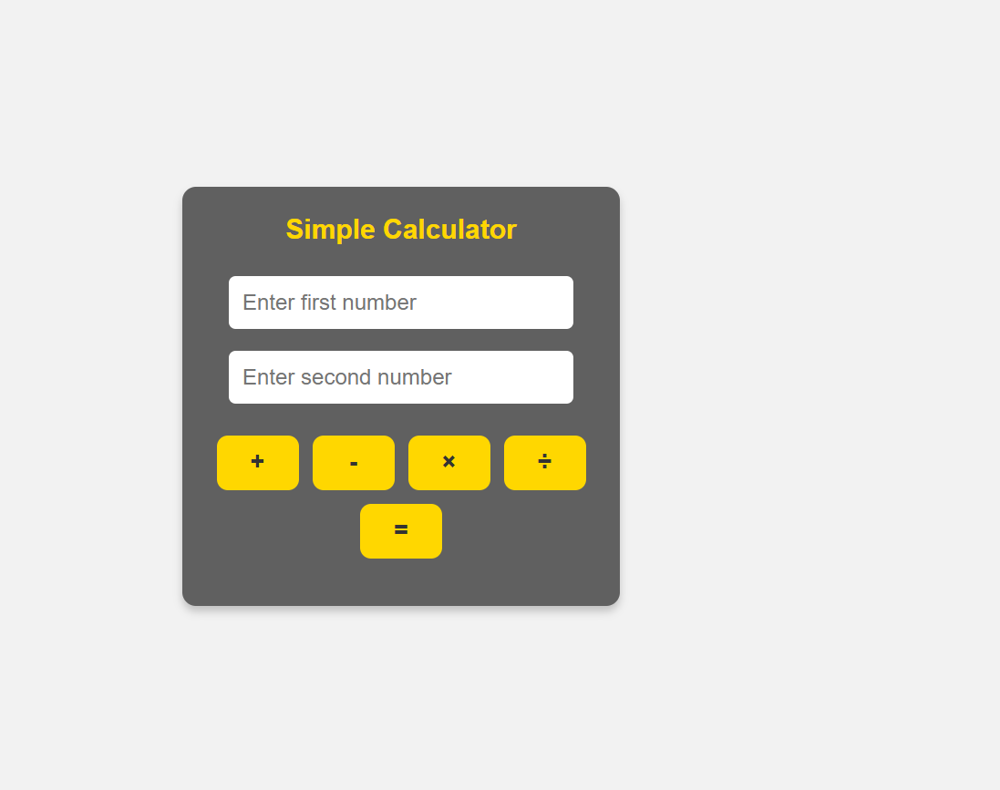

# Simple Calculator
A basic calculator built with HTML, CSS, and JavaScript for performing simple arithmetic operations.

---
## Features
- User-friendly interface
- Supports basic arithmetic operations (+,-,x,/)
- Responsive design 
- Instant result display

---
## Tech Stack 
- **HTML** - structure
- **CSS** - Styling & layout
- **JavaScript** - Functionality

---
## Screenshot

---
## How to Use
1. Clone or download this repository
2. Open `index.html` in your browser
3. Enter two numbers and select the operation 
4. See the result instantly

---

## Future Improvements
- Add keyboard support
- Add scientific calculator features
- Improve mobile responsiveness

---
## License 
This project is open-source and free to use 